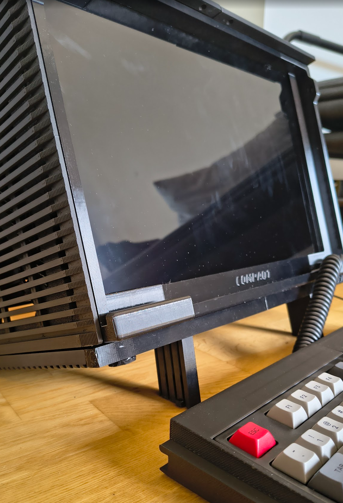

# Compaqt Portable x86-64 All-in-One SFF PC

---

## What is this?

This is the case for a luggable, all-in-one SFF PC, which is an homage to and inspired by the Compaq Portable line of computers ([Wikipedia](https://en.wikipedia.org/wiki/Compaq_Portable_386)).
The design phase of the project took a couple of months as an exercise in learning FreeCAD. The internal structure of the case is inspired by the excellent Beam case ([BeamCase on Printables](https://www.printables.com/model/826374-beamcase-sw-sff-sandwich-case-in-18-different-size)).
Aluminium beams are recommended but I used four 300mm 3D printed beams of PETG material.
The case is sandwiched with a 16" LCD monitor using a custom 3D-printed bracket. It also has a mouse hidden at the back, inside a little cabinet.

[Here's the orginal post on Reddit.](https://www.reddit.com/r/cyberDeck/comments/1lx5285/my_portable_retro_allinone_cyberdeck/)

[This project is also published on Printables.com](https://www.printables.com/model/1354903-compaqt-portable-x86-64-all-in-one-sff-pc)

---

## Features

Overall, this compact PC is very practical and easy to carry around. Here's a list of features included:

- **All-in-one SFF PC** with a handle and a single power cable coming out of it  
- **120Hz touchscreen** (144Hz possible, limited by HDMI)  
- **TKL mechanical keyboard** locked in place with magnetic latches, doubles as the front panel  
- **All wired**, except for wireless networking (Ethernet supported)  
- **Back door cabinet** holds mouse and power cable  
- **Two feet** hidden in the base for adjustable tilt  
- **One intake & one exhaust 80mm slim fans**  
- **Piezo speaker (buzzer)** for system alerts  

---

## Hardware Specs

- **CPU:** AMD 8400F (AliExpress) with OEM cooler  
- **Motherboard:** MSI B650M Pro  
- **RAM:** 16GB Apacer DDR5 (1 stick for now)  
- **GPU:** AMD Radeon RX 570 4GB VRAM  
- **PSU:** Metalfish 500W SFX PSU (AliExpress)  
- **Storage:**  
  - 1TB NVMe SSD (Linux)  
  - 2.5" SATA3 SSD (Windows 11)  
  - 2TB 2.5" HDD (general storage)  
- **Keyboard:** KPRepublic XD87 (modded with Kailh Box V2 clicky switches)  
- **Mouse:** Logitech G102 (wired)  
- **Monitor:** ZEUSLAP 16" portable touchscreen (144Hz, 2560x1600)  

All peripherals and the monitor are internally connected via USB. Power is split internally for the PC and display. HDMI and USB-C cables to the monitor are routed with 180-degree adapters from AliExpress.

---

## Materials

- **Filament:**  
  - PETG for structural parts (beams, brackets, top handle base, frontside and backside walls)
  - Matte PLA for aesthetic cover panels  
- **8x drywall phillips screws** - 35mm long
- **Magnets** - 12x 5x2mm, 24x 8x2mm
- **Brass copper inserts** - embedded inside the 1515 nut adapters for M3/M4 screws
- **Rubber feet** - for keyboard and bottom of case
- **Angled HDMI (1x) and USB-C adapters (2x)** 
- **Standard PC screws and standoffs**  
- **Velcro and cable ties** for internal cable management  
- **A metal handle** - 120mm distance between the two holes
- **16mm switch button** - non-latching
- **2x 80mm slim cooling fans**
- **USB 3.0 Panel Mount Dual Port USB 3.0 Female motherboard header** - for two internal USB ports
- **Power splitter** - IEC320 3 pin C14 TO Male C13+2 hole EU 4.0mm Female socket AC power cord 0.3m
- **Power cable C13** 
- **HDMI cable**
- **Piezo buzzer (passive speaker)**
- **Optional:** Aluminum 1515 beams for added rigidity (PETG version used here)

Most of the materials were aqcuired from AliExpress.

---

## Assembly

The case was originally printed using the BambuLab A1 printer with a 0.6mm hardened steel nozzle.
Note that the 1515 beam frame has been scaled up to 1616 because it was really fragile.

1. **Print all structural components** - use PETG for side panels and beams (1515 profiles) and PLA for cover panels.
2. **Assemble the 1515 beam frame** (printed with PETG) according to the CAD layout.
3. **Install motherboard, PSU, and drives** into the frame.  
4. **Attach 80mm intake and exhaust fans** to their respective positions.  
5. **Wire up all internal connections** for PSU, peripherals and display.  
6. **Connect angled HDMI and USB-C adapters** to the GPU and route to monitor.  
7. **Install the monitor bracket** and secure the 16" screen.   
8. **Attach all panels magnetically**, except for the bottom and rear which are mechanically fixed.  
9. **Mount the keyboard with magnetic latches** on the front.  
10. **Store the mouse and cable** in the rear compartment.

---

## Gallery

|  |  |  |
|-------------------------|-------------------------|-------------------------|
|  |  |  |
|  |  |  |
|  |  |  |
|  |  |  |
|  |  |  |

---

Feel free to fork, remix, and share! Contributions or suggestions are welcome.

---

## License 

GPL 3.0